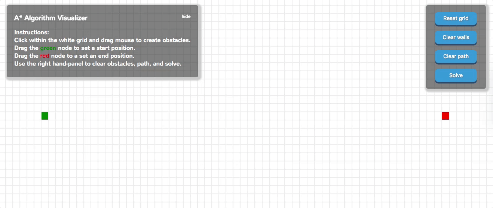

#A* Algorithm Visualizer

####Try it out at [http://www.marcmoy.io/AStarVisualizer/](http://www.marcmoy.io/AStarVisualizer/)

###Background
The A* Algorithm utilizes heuristic and movement values to determine the shortest path from a start node to an end node. Nodes from an open list and a closed list are compared to a 'current' node as that node travels across the grid until the end node is found. As the current node travels across the grid, parent nodes are assigned to keep track of the path leading to the end node. Using recursion, that path is then traced to produce the shortest path.
